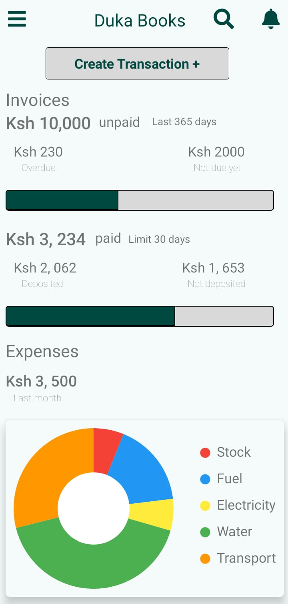
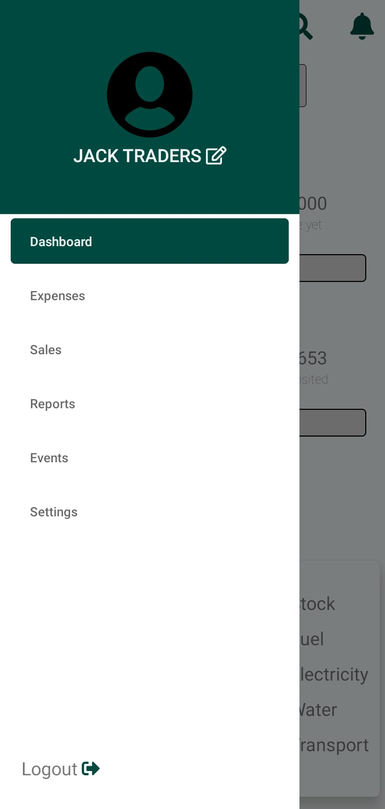

# Duka Books (A React Native App)

## Description

This Android application is designed to simplify and streamline the bookkeeping process for Small and Medium Enterprises (SMEs) in Kenya. 
It provides an efficient way for SMEs to record their day-to-day financial transactions securely and generate essential financial reports. 
The app aims to improve business management and financial accountability for SMEs, ultimately contributing to their success.

## Features

- User-friendly login and registration system.

- Secure storage and retrieval of financial transactions.
- Dashboard with cash flow and expense summaries for previous business days.

- Creation and management of transaction records.

- Viewing and searching of previous transactions.

- Generation of financial reports.
- Invoicing feature for sending bills to customers via email. (under development)
- User notifications for pending bills.( under development)

